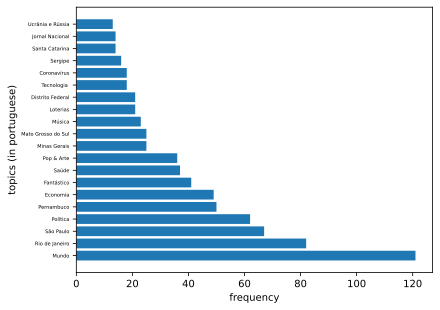
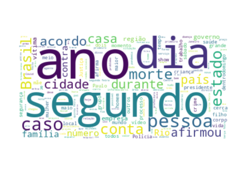
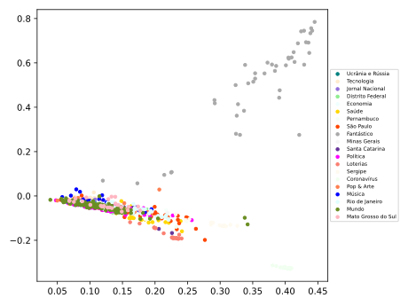
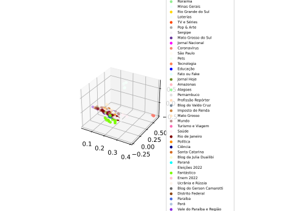
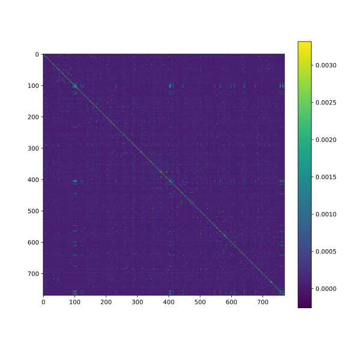

# web scrapping texts from g1.globo.com for NLP

The idea here is to collect many articles from the website
<em>g1.globo.com</em> to apply <strong>NLP</strong> techniques

The set of words here is in portuguese.

After running
```
./database/collect_data.sh
```
A database, using the RDBMS <strong>SQLite3</strong>, called
<em>g1database.db</em> will be created. This database
has only one relation, given by the scheme:
```
create table articles (
    id          TEXT,
    created_at  TEXT, 
    url         TEXT NOT NULL,
    section     TEXT,
    summary     TEXT,
    title       TEXT NOT NULL,
    text        TEXT NOT NULL,

    PRIMARY KEY(id, created_at)
);
```

To run all scripts at once issue the command
```
./run_scripts.sh
```

## Statistics
| **Database statistics**   |      |
| :---                      | :--- |
| Number of texts collected | 398 |

## Plots

+ Plot showing all topics and their frequencies
<div align='center'>
    
</div>

+ Plot showing word frequencies -- without the stopwords
<div align='center'>
    
</div>

---

Let $\mathcal{W}$ be the set of <em>bag of words</em>
$$ \mathcal{W} = \\{w = (w_i) \in \mathbb{R}^{\mathcal{V}} \\},$$
where $\mathcal{V}$ is the set of most frequent words. 

Then I will apply to each of these vectors a transformation where
each of its coordinates will be given by their term frequency adjusted
by the <em>idf</em> term. These <em>idf</em> terms take into consideration
the corpus 
$$\mathcal{C} = \\{d\; d \text{ is a document whose topic has appeared more than 3 times} \\}.$$

Finally, after the transformation above,  I will project the vectors into 
$\mathbb{R}^2$ and
$\mathbb{R}^3$ using the truncated SVD transformation.
<div align='center'>
    
    
</div>

Despite the fact that low dimension vector spaces loses a lot of structure we 
can still see some topics with a high distance from other topics.

Embedding these vectors into $\mathbb{R}^{300}$ we get a better
variance description of the phenomenon. Below a correlation plot 
showing the relation of the $i-th$ features
<div align='center'>
    
</div>

## Dependencies
+ SQLite3
+ Python3 libraries:
    - bs4 
    - requests (download urls)
    - json
    - re
    - sqlite3
+ PERL
+ wget

The programs were tested in a GNU/LINUX machine.
